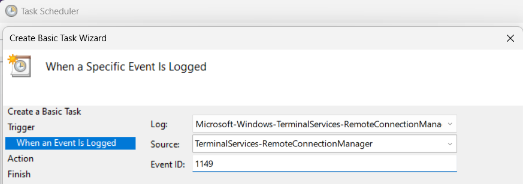

# winevent-alert

Send alert when Windows Event logged.


| OS Argument | Description    | Example                                                                |
|-------------|----------------|------------------------------------------------------------------------|
| 1           | Title          | RDP                                                                    |
| 2           | Event Log Name | Microsoft-Windows-TerminalServices-RemoteConnectionManager/Operational |
| 2           | Event ID       | 1149                                                                   |

> Arguments are for fetching latest event log, have nothing to do with launching/triggering. You should create your own Task via Windows Task Scheduler.


## Usage

1. Clone repository.
```
git clone https://github.com/wirekang/winevent-alert
```

2. Write `secret.go`(EVERYTHING IS STRING)

```go
package main
const DISCORD_WEBHOOK_URL = "https://discord.com/api/webhooks/..."
const DISCORD_USER_ID="1234567890"
```

3. Test
```
go run . RDP Microsoft-Windows-TerminalServices-RemoteConnectionManager/Operational 1149
```

4. Run `build.cmd`. Now executable file is located in `C:/Users/{USER_NAME}/winevent-alert.exe`

5. Create Task:





Result:


